# PUNTO DE CONTROL 6

## :copyright: Autor

- :camera: 

- :man: **Cesar Augusto Núñez Medina**
- :e-mail: cesar23augusto16@gmail.com

---

## :black_circle: S7_Static_cast.cpp

.png)

---

## :white_circle: S7_Static_Cast_vs_Dynamic_Cast1.cpp

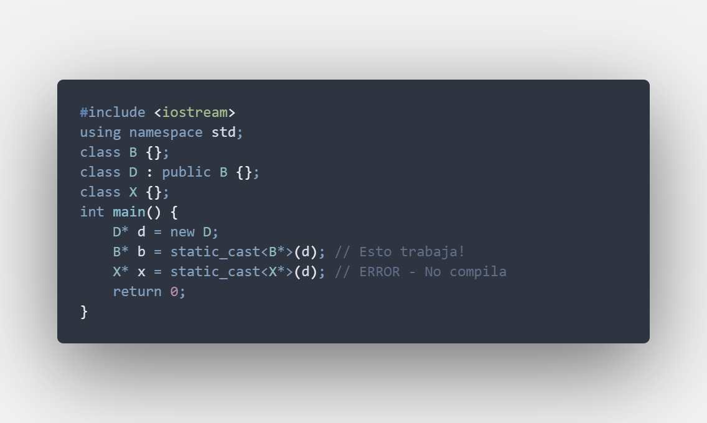

---

## :black_circle: S7_Static_Cast_vs_Dynamic_Cast2.cpp

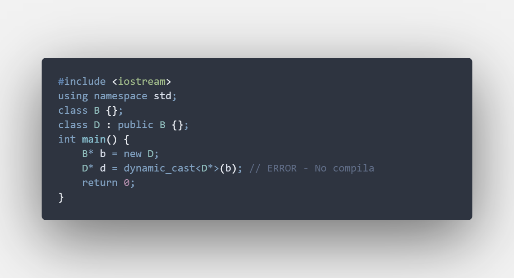

---

## :white_circle: S7_Static_Cast_vs_Dynamic_Cast3.cpp

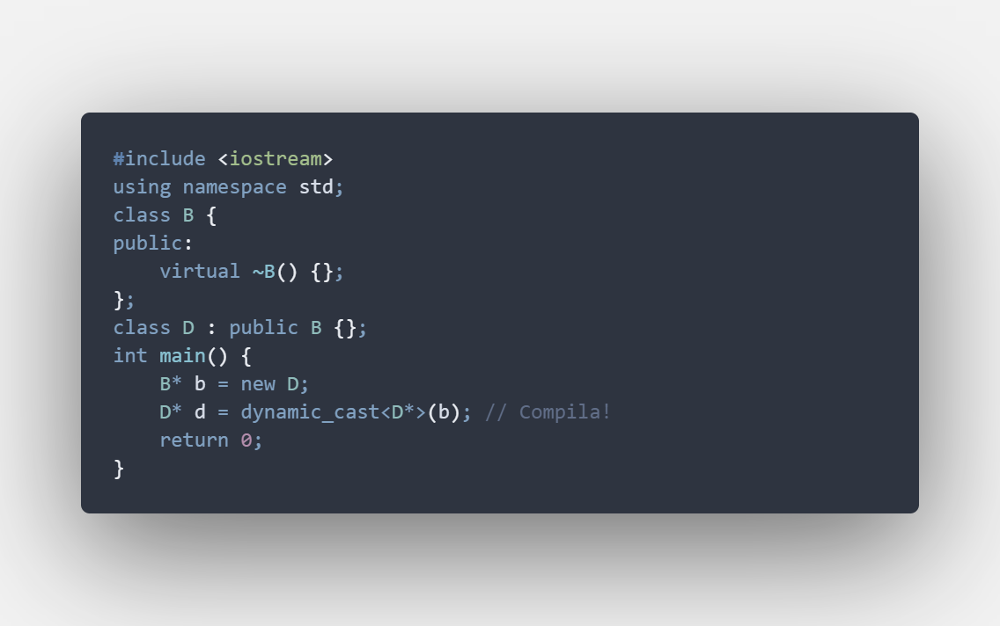

---

## :black_circle: S7_fun.cpp

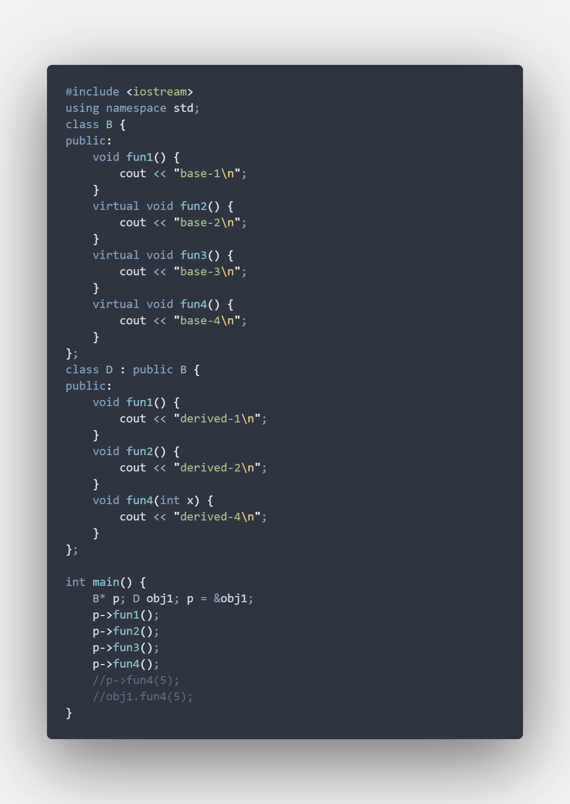

---

## :white_circle: S7_typeid.cpp

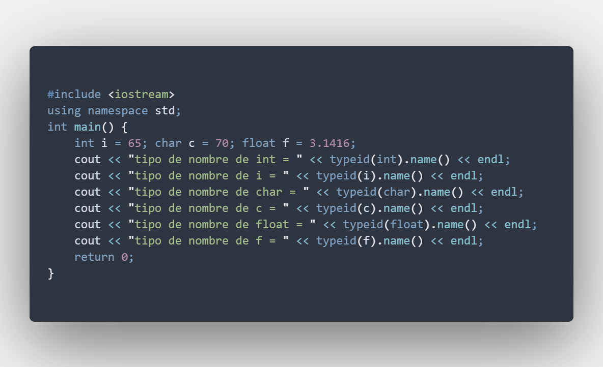

---

## :black_circle: S7_files.cpp

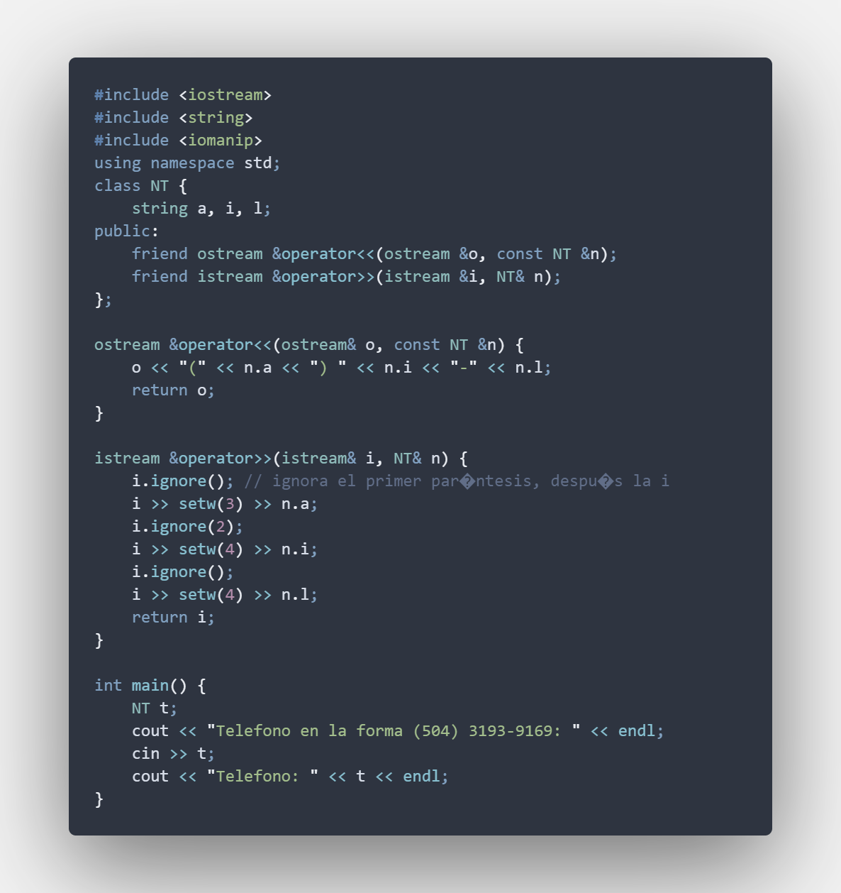

---

## :white_circle: S7_iostreamSobrecargaOperadores.cpp

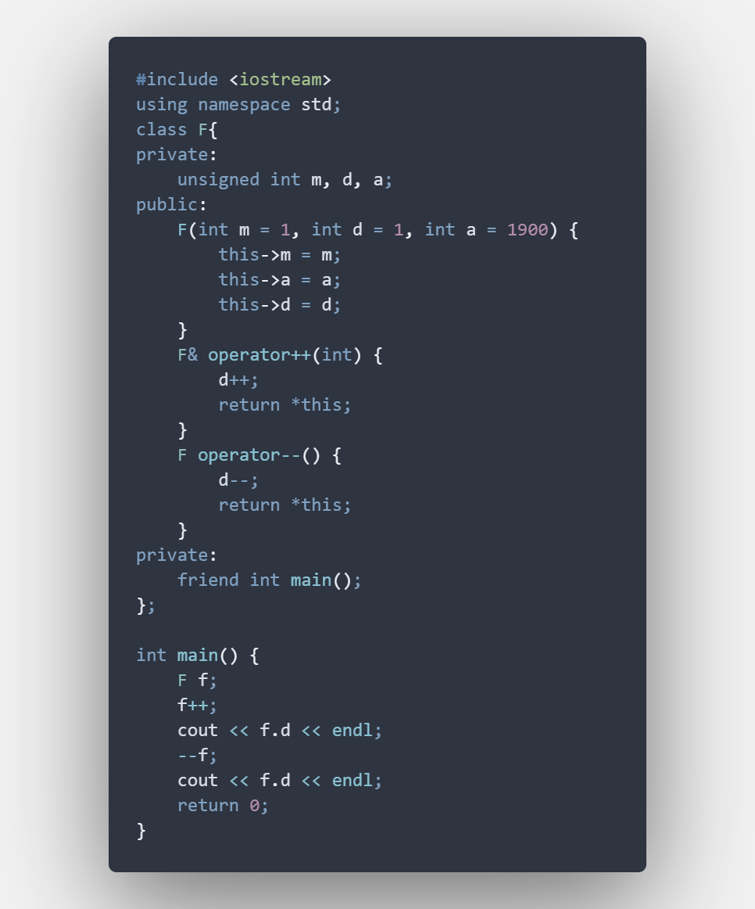

---

## :black_circle: S7_SobrecargaOperadores_V2.cpp (sobrecargas faltantes, elementos añadidos, con enum)

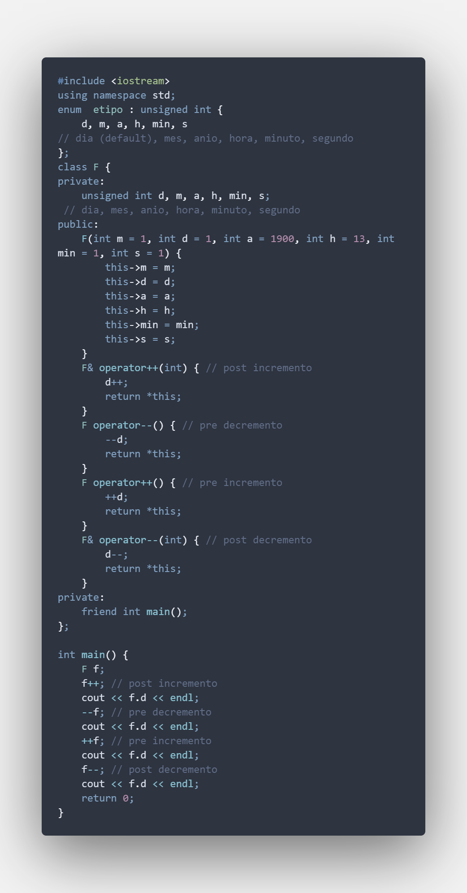

---
---

## :white_circle: Salida - S7_Static_cast.cpp

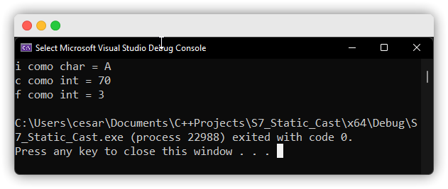

---

## :black_circle: Salida - S7_Static_Cast_vs_Dynamic_Cast1.cpp

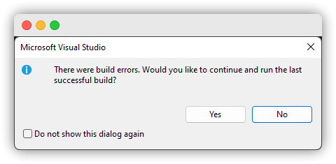

---

## :white_circle: Salida - S7_Static_Cast_vs_Dynamic_Cast2.cpp

---

## :black_circle: Salida - S7_Static_Cast_vs_Dynamic_Cast3.cpp

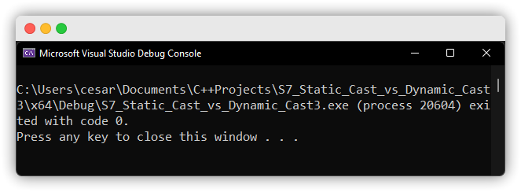
---

## :white_circle: Salida - S7_fun.cpp

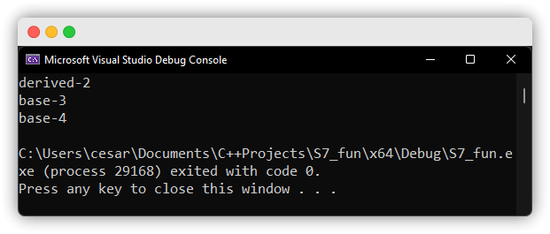

---

## :black_circle: Salida - S7_typeid.cpp

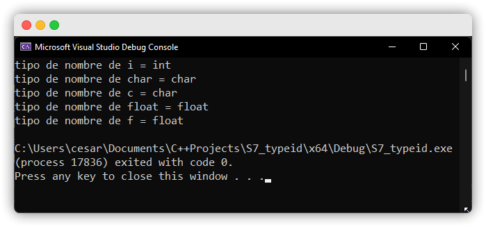

---

## :white_circle: Salida - S7_files.cpp

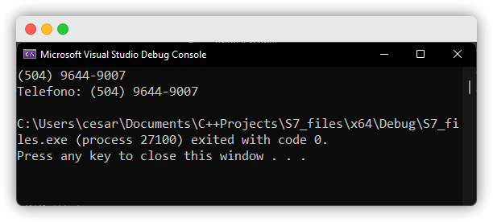
---

## :black_circle: Salida - S7_iostreamSobrecargaOperadores.cpp

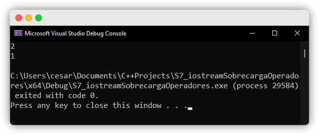

---

## :white_circle: Salida - S7_SobrecargaOperadores_V2.cpp

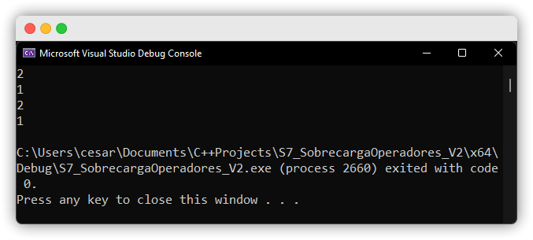

---

#### Herramientas:
- :package: [Visual Studio Code](https://code.visualstudio.com/)
- :camera: [Polacode-2020 v0.5.2](https://github.com/jeff-hykin/polacode)
- :notebook: [Markdown Cheatsheet](https://github.com/adam-p/markdown-here/wiki/Markdown-Cheatsheet)
- :smile: [Emoji Cheat Sheet](https://www.webfx.com/tools/emoji-cheat-sheet/)
